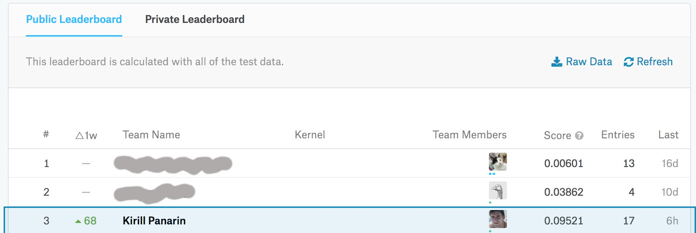

## Dog Breeds Classification

This repo is intended to contain a set of scripts and data for reproducing dog breed classification model training, analysis, and inference.

### Prerequisites 

1. Install Python 2.7
2. Install all required python dependencies: `pip install -r requirements.txt`

### Download Data
 

1. `cd` to this repo root directory
2. Execute setup script: `sh ./setup/setup.sh`. In its turn the script executes the following other scripts:
    * Creates all required directories: `sh ./create_dirs.sh`
    * Downloads Google Inception model: `sh ./inception_download.sh`. The link to the frozen TensorFlow model is taken from [here](https://github.com/tensorflow/models/blob/master/tutorials/image/imagenet/classify_image.py#L51)
    * Downloads [Stanford Dogs Dataset](http://vision.stanford.edu/aditya86/ImageNetDogs/): `sh ./download_stanford_dogs_dataset.sh` 

### Prepare Data

1. Convert downloaded Stanford Dogs Dataset to TensorFlow friendly [TFRecords](https://www.tensorflow.org/programmers_guide/datasets#consuming_tfrecord_data) file: `python -m src.data_preparation.stanford_ds_to_tfrecords`

### Train

This section describes how to build dog breed classification dense neural network model on top of the pre-trained by Google deep neural network (namely Inception model).

1. Give a name to the model your are going to train by assigning a name to `CURRENT_MODEL_NAME` variable in [consts.py](src/common/consts.py#L14) script
2. Configure number of layers and number of units in each layer by setting `HEAD_MODEL_LAYERS` variable in [consts.py](src/common/consts.py#L18)
3. Train the model: `python -m src.training.train`. It might take 25-35 minutes depending on the depth of your model and number of epochs (which could be configured in the train.py script itself). TensorBoard could be used to observe the training process: `tensorboard --logdir=./summary`

### Freeze Model

1. Freeze the model: `python -m src.freezing.freeze`. This will bind Inception model with the trained on the previous step "head" model and serialize it as a TensorFlow graph with variables represented as constants. This frozen model will be ready to use for classification tasks.

### Analyze

1. Produce CSV file with predicted vs actual breed. This could be used to analyze precision on the training data e.g. plot a confusion matrix (see [Confusion.ipynb](Confusion.ipynb)). Result CSV file goes to `metrics/training_confusion.csv`

### Infer

1. Use the model frozen on the previous step to classify an image either available on the filesystem or downloadable as an HTTP resource: 

`python -m src.inference.classify uri https://raw.githubusercontent.com/stormy-ua/dog-breeds-classification/master/images/shih-tzu.jpg` 

`python -m src.inference.classify file images/airedale.jpg`
 
 In my case the model was training for 25 mins (5000 epochs) and the following sample classification outputs were produced:
 
 
 
 (Image is taken from [http://dogtime.com/dog-breeds/airedale-terrier](http://dogtime.com/dog-breeds/airedale-terrier))

| breed | probability |
| ------ | ------ |
| airedale | 0.992064 |
| otterhound | 0.005108 |
| chesapeake_bay_retriever | 0.001259 |
| irish_terrier | 0.000635 |
| wire-haired_fox_terrier | 0.000378 |

(Image is taken from [http://dogtime.com/dog-breeds/shih-tzu](https://dogtime.com/dog-breeds/shih-tzu#/slide/1))

| breed | probability |
| ------ | ------ |
|        shih-tzu | 0.752834 |
|           lhasa | 0.234748 |
| tibetan_terrier | 0.007598 |
|     maltese_dog | 0.000969 |
|japanese_spaniel | 0.000936 |

These examples also available in the [Inference.ipynb](Inference.ipynb) Python notebook.

Have a fun!

### Running in Docker

The already pre-built model w/ all the scripts and Python notebooks for inference are available in the docker container. Run the container:

`docker run -p 8888:8888 -p 6006:6006 kirillpanarin/dog_breed_classification`

Navigate a browser to `http://localhost:8888/notebooks/Inference.ipynb` and you will be all set for doing inference against real-life dog images.

### Kagle Dog Breed Classification Competition

This model ranked #3 in the [Kaggle's Dog Breed Classification Challenge](https://www.kaggle.com/c/dog-breed-identification). 

